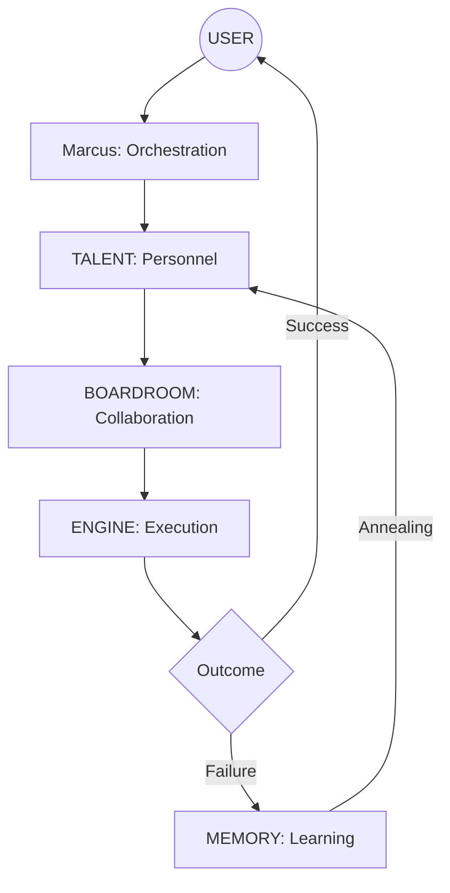

# 🗺️ AgOS 3.0: The Hive Mind Sitemap

The Antigravity Agency operates as a **Stateful Hive Mind** across four integrated layers. This architecture ensures that intelligence is probabilistic, but the outcomes are deterministic.

---

## 🏗️ The 4-Layer Stack

### 1. The Talent (Layer 1)
*The fundamental building blocks - Elite Human-Named Personas.*
- **Personas**: 39 specialized agents ([View Team Roster](docs/TEAM.md)).
- **Skills**: Individual `SKILL.md` files in `.agent/skills/[handle]`.
- **Methodology**: Standard Operating Procedures in `.agent/skills/methodology/`.

### 2. The Boardroom (Layer 2)
*The strategic orchestration layer.*
- **Communication**: Real-time sync in `.agent/boardroom/chatroom.md`.
- **Meetings**: Mission briefings and team talks governed by `.agent/boardroom/PROTOCOL.md`.
- **Governance**: Rules of engagement in `.agent/rules/`.

### 3. The Engine (Execution) (Layer 3)
*The deterministic core.*
- **Tools**: Python and Node.js scripts in `execution/`.
- **Validation**: Strict quality gates (**@Sam**, **@Priya**, **@Vigil**).
- **Indexing**: Single source of truth in `execution/asset_indexer.py`.

### 4. The Memory (Layer 4)
*The persistence and learning loop.*
- **History**: Task outcomes logged in `.agent/memory/task-history.json`.
- **Health**: Performance tracking in `.agent/memory/agent-health.json`.
- **Feedback**: Self-annealing logic via `.agent/memory/FEEDBACK_PROTOCOL.md`.

---

## 🎼 Orchestration Flow

---

*Last Updated: 2026-02-05 | AgOS 3.0 - Architecture Sitemap*
